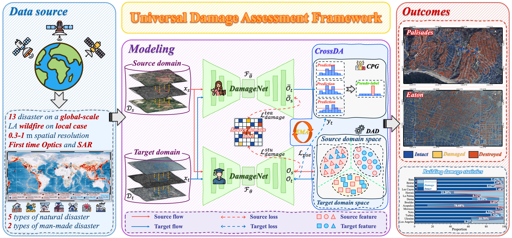

# :star2: Universal rapid building damage assessment: From global scale to local application:star2:

https://github.com/user-attachments/assets/dc248175-5aa0-4c4b-ba4a-d3aeb3b28761

## :newspaper:News

* **` Mar. 09th, 2025`**:  We have uploaded the [weights](#dartmodel-zoo) of all the models and the research datasets ([Zendo](https://zenodo.org/records/18918459)).
* **` Mar. 06th, 2025`**: Our UniDAF project was created and all the code is uploaded! :smiley:

## :star:Overview


- UniDAF is the first multi-modal change detection framework for timely post-disaster imagery acquisition. 
- In view of the interference usually accompanied by timely post-disaster imagery, we combined the fine-grained information of optical imagery and the all-weather observation ability of SAR imagery to establish DamageNet.
- The occurrence of disasters is highly uncertain, which makes the method of constructing data sets based on sudden disaster events unable to meet the requirements of timely emergency response. Based on this, our DomainStr gradually transfers to the assessment task of sudden disaster events by learning the representation of historical disaster events without additional data annotation.

##  :dart:Model Zoo

| Method | Background↑ | Intact↑ | Damaged↑ | Destroyed↑ | mIoU ↑ | Weights |
|------|-----------|--------|---------|-----------|--------|----------|
| UniDAF (LA-Wildfire) | 94.50 | 57.94 | 4.59 | 57.78 | 53.70 | [Download](https://drive.google.com/file/d/1Wly0jafTLFumS5n3ZD8OZPGlXPudx7jB/view?usp=sharing) |
| DamageNet (MobileNet) | 94.62       | 55.47   | 27.35    | 40.18      | 54.41 | [Download](https://drive.google.com/file/d/1nA4hW5w-32yXguO21BsJpyzk9gA5N7Nq/view?usp=sharing) |
| DamageNet (ResNet-18) | 94.78 | 53.56 | 24.98 | 45.64 | 54.74 | [Download](https://drive.google.com/file/d/1_j58YiQntcirjrq2nZp6fCVD8WTbfs5O/view?usp=sharing) |
| DamageNet (PVTv2-b3) | 95.93 | 60.42 | 32.83 | 46.83 | 59.00 | [Download](https://drive.google.com/file/d/1jbhKC7sTcDCaHPbHx38j6b53C0HwpEex/view?usp=sharing) |
| UniDAF (MobileNet)    | 94.11       | 52.34   | 38.20    | 42.20      | 56.71  | [Download](https://drive.google.com/file/d/1zhX2R8poxp2z9Gd5s8AOCon41Dzt-JfX/view?usp=sharing) |
| UniDAF (ResNet-18)    | 94.98       | 56.02   | 41.68    | 44.11      | 59.20  | [Download](https://drive.google.com/file/d/1gTMxqo1-yAZsJgUjV3X44uAyaKo7nsgm/view?usp=sharing) |
| UniDAF (PVTv2-b3)     | **96.10**  | **66.89** | **49.05** | **56.67**  | **67.18** | [Download](https://drive.google.com/file/d/1UFvcJ5R0q5AjaaLt-r5BYAjlqE2Tv0cp/view?usp=sharing) |

## :satellite:Dataset Preparation
<details open>
<div align="center">

</div>


Please download the study datasetfrom [Zenodo](https://zenodo.org/records/18918459). After the data has been prepared, please make them have the following folder/file structure:

```
${DATASET_ROOT}   # Dataset root directory, e.g. /home/username/dataset/
│
├── DisasterSet
│   │
│   ├── pre-event
│   │    ├── bata-explosion_00000000_pre_disaster.tif
│   │    ├── bata-explosion_00000001_pre_disaster.tif
│   │    ├── bata-explosion_00000002_pre_disaster.tif
│   │    ...
│   │
│   ├── post-event-opt
│   │    ├── bata-explosion_00000000_post_disaster_opt.tif
│   │    ...
│		│
│   ├── post-event-sar
│   │    ├── bata-explosion_00000000_post_disaster_sar.tif
│   │    ...
│   │
│   └── target
│        ├── bata-explosion_00000000_building_damage.tif
│        ...
│
└── LA-WildFire
    ├── ...
```
</details>

## :computer:Installation

<details open>

**Step 0**: Clone this project and create a conda environment:

   ```shell
   git clone https://github.com/KotlinWang/UniDAF.git
   cd UniDAF
   
   conda create -n unidaf python=3.12
   conda activate unidaf
   ```

**Step 1**: Install pytorch and torchvision matching your CUDA version:

   ```shell
   pip install torch==2.8.0 torchvision==0.23.0 torchaudio==2.8.0 --index-url https://download.pytorch.org/whl/cu129
   ```

**Step 2**: Install requirements:

   ```shell
   pip install -r requirements.txt
   ```

</details>

## :running: Training

```shell
bash train_unidaf.sh configs/unidaf_sk_resnet18.yaml
```

If the pre-trained weights download fails, please use: 
```shell
HF_ENDPOINT=https://hf-mirror.com bash train_unidaf.sh configs/unidaf_sk_resnet18.yaml
```

## :mag: Testing

"-existing_weight_path" represents the addition of the weights to be tested.

"-inferece_saved_path" represents the path where the test result images are saved, including both the color and the original images.

```
python script/infer_unidaf.py -existing_weight_path ../your weights path -inferece_saved_path ./your save path
```

## :rocket:Supported Networks:

<details open>

| CNNs | Transformer | Mamba | UAD |
|-----|-------------|-------|-----|
| UNet | UNetFormer | UrbanSSF | MeanTeacher |
| DeepLabv3+ | DamageFormer | ChangeMamba | AdaptSeg |
| [UANet](https://github.com/Henryjiepanli/Uncertainty-aware-Network) | ChangeFormer |  | AdvEnt |
| [CFDNet](https://github.com/whf0608/CFDNet) | DamageCAT |  |  |
| SiamCRNN |  |  |  |
| ACABFNet |  |  |  |

</details>

## :handshake:Acknowledgement

The authors would also like to give special thanks to [BRIGHT](https://github.com/ChenHongruixuan/BRIGHT) of Capella Space, [Capella Space's Open Data Gallery](https://www.capellaspace.com/earth-observation/gallery), [Maxar Open Data Program](https://www.maxar.com/open-data) and [GoogleEarth](https://earth.google.com/web) for providing the valuable data.

## Citation

If you find this project useful in your research, please consider citing:
```
```


